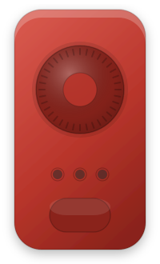
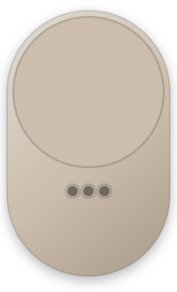
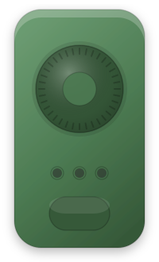

# IKEA BILRESA Remote

A Home Assistant integration that turns the IKEA BILRESA scroll wheel remote
(E2490) into something you can actually automate: every press becomes an event,
the three internal channels become selectable modes, and each mode can run its
own action sequence.

[](https://github.com/DieserMerlin/BILRESA-Zigbee-HA/actions/workflows/validate.yml)
[](https://hacs.xyz/)
[](LICENSE)

<p>
  
  
  
</p>

The illustrations above are the same SVGs the setup wizard shows; the LEDs light
up according to the active mode. They are original drawings, not IKEA product
photos — see [ASSETS.md](ASSETS.md).

---

## What this does

- Subscribes directly to the remote's Zigbee2MQTT device topic, so it sees the
  `action_group` field that identifies which of the three internal channels a
  press came from.
- Exposes one `event` entity per remote with normalised event types
  (`click`, `click_on`, `click_off`, `double`, `triple`, `wheel_up`,
  `wheel_down`) and the mode, level and channel as attributes.
- Adds a writable `select` for the active mode, a "Next mode" button and two
  diagnostic sensors (last action, wheel level).
- Lets you bind an action sequence to every (mode, press) combination in the
  UI, using the same action editor as the automation editor. Sequences run as
  Home Assistant scripts, with visible traces.
- Normalises the protocol quirks: the wheel level is absolute and its ZCL
  "non value" (`null`) is mapped to 255, the first level after a restart only
  calibrates instead of firing, and fast turns are throttled with a guaranteed
  trailing edge so the final value always arrives.

## Why this exists

Out of the box the BILRESA gives you a battery sensor, a voltage sensor and an
identify button. Nothing else.

The reason is that Zigbee2MQTT does not create an entity for `action` by default
(`homeassistant.legacy_action_sensor` and
`homeassistant.experimental_event_entities` are both off), so the presses only
exist inside the JSON payload of `zigbee2mqtt/<ieee>`. You can subscribe to that
with an MQTT trigger — but then you are on your own with the alternating on/off
single click, with `action_level: null`, and with the channel handling.

And the channels are the real point. The remote has three internal channels,
switched by the lower button, and they are the only reason it has a lower button
at all. That button sends nothing over Zigbee. The channel is visible exclusively
as a Zigbee group id inside `action_group` on the presses that are groupcast.
Neither Home Assistant's MQTT device triggers nor Zigbee2MQTT's `event`/`sensor`
entities carry that field, so with the standard tooling the second and third
channel simply do not exist.

This integration reads the raw topic, keeps track of the channel, and — for
setups where the channels were never unlocked (see below) — offers an internal
mode that works without them.

## Requirements

- Home Assistant 2026.3 or newer
- The MQTT integration set up and connected
- Zigbee2MQTT (developed and measured against 2.13.0) with the remote paired
  and the default JSON output enabled
- An IKEA BILRESA remote with scroll wheel, model `E2490`

## Installation

### HACS (custom repository)

1. Open HACS.
2. Three-dot menu → **Custom repositories**.
3. Repository: `https://github.com/DieserMerlin/BILRESA-Zigbee-HA`,
   category: **Integration**. Add.
4. Search for **IKEA BILRESA Remote**, download it.
5. Restart Home Assistant.
6. **Settings → Devices & services → Add integration → IKEA BILRESA Remote**.

### Manual

1. Download the release ZIP (`bilresa_remote.zip`) or clone the repository.
2. Copy the contents so that you end up with
   `<config>/custom_components/bilresa_remote/manifest.json`.
   When using the ZIP, its contents already are the component directory.
3. Restart Home Assistant.
4. **Settings → Devices & services → Add integration → IKEA BILRESA Remote**.

## Setup

The setup is a guided flow; there is nothing to write into `configuration.yaml`.

1. The first step checks that MQTT is available and asks for the Zigbee2MQTT
   base topic (`zigbee2mqtt` unless you changed it).
2. The tutorial step explains — with pictures — how the remote works, what the
   lower button does, and how to unlock the second and third channel if you want
   them. Read it once; it answers most questions this README raises.
3. Then you add one remote at a time. The device list is read from the retained
   `zigbee2mqtt/bridge/devices` topic, so you pick your remote by its friendly
   name instead of typing an IEEE address.
4. Per remote you choose the mode source and the mode names, and then bind
   actions per mode.

To change anything later: **Configure** on the integration card, or the
three-dot menu on a remote → **Reconfigure**. Editing an action mapping does not
reload the integration; only structural changes (adding or removing a remote,
changing the base topic) do.

## Button reference

Everything below was measured on real hardware with Zigbee2MQTT 2.13.0. It is
not copied from documentation, and it differs from the documentation in places.

| What you do | Zigbee2MQTT `action` | Integration action | Carries the channel? |
| --- | --- | --- | --- |
| Click the wheel once | `on` / `off`, alternating | `click` (or `click_on` / `click_off`) | yes, `action_group` |
| Click the wheel twice | `on_double` | `double` | **no** |
| Click the wheel three times | `off_double` | `triple` | **no** |
| Turn the wheel | `brightness_move_to_level` with `action_level` 1–255 | `wheel` → `wheel_up` / `wheel_down` | yes, `action_group` |
| Press the lower button | *nothing is sent* | switches the internal channel only | — |
| Four or more clicks, long press | *nothing is sent* | — | — |

Three things in that table regularly surprise people:

- **There is only one clickable surface**, the wheel itself. The lower button is
  not a second key.
- **A single click alternates `on` and `off`.** That is a counter inside the
  remote, not a state of anything in your home. By default both map to the same
  `click` action; you can split them per remote if you want the toggle
  behaviour, but be aware that it drifts as soon as the light is switched from
  somewhere else.
- **`off_double` is the triple click**, not a second double click. Counter-
  intuitive, verified repeatedly.

### Channels and group ids

| `action_group` | Channel / mode |
| --- | --- |
| `21658` (0x549A) | 1 |
| `21659` (0x549B) | 2 |
| `21660` (0x549C) | 3 |

The group id identifies the **channel**, never the remote. Every BILRESA in your
network sends to the same three ids; the remote is identified by the topic it
publishes on.

### Unlocking the device channels

Channels 2 and 3 only work after a physical Touchlink unlock at the remote. Until
that has been done, the remote sends everything to `21658` and the lower button
does nothing at all. That is the state most remotes are in.

**You do not have to do any of this.** Set the remote's mode source to
`internal` and the integration switches modes on its own — no Touchlink, no
groups, all modes usable. The unlock is only worth it if you want the lower
button on the remote itself to switch modes.

If you do want it, the full illustrated walkthrough lives in the setup wizard:
**Settings → Devices & services → IKEA BILRESA Remote → Configure → Setup
guide**. It stays reachable after setup, so you can come back to it at any time.
The short version:

1. **Touchlink each channel against a dummy Zigbee device.** Hold the remote next
   to a bulb you can safely play with and press the pairing button 4× quickly.
   Repeat for channel 2 and channel 3, switching channels with the lower button
   in between.
2. **Create the three groups** `21658`, `21659` and `21660` in Zigbee2MQTT.
3. **Add the dummy device to all three groups, then remove it again.** The
   add/remove cycle is the actual point: it writes the group membership into the
   remote, which is what teaches it the three ids. Removing the device afterwards
   drops the direct Touchlink binding, so the bulb stops reacting on its own and
   Home Assistant is back in charge of what a press does.

After that the lower button really switches channels, and every single click and
wheel turn carries the matching `action_group`.

### Sample payloads

```json
{"action":"on","action_group":21658,"battery":100,"linkquality":114,"voltage":0}
{"action":"brightness_move_to_level","action_group":21658,"action_level":45,"action_transition_time":1,"battery":100,"linkquality":105,"voltage":0}
{"action":"on_double","battery":100,"identify":null,"linkquality":114,"voltage":0}
```

## Modes

The mode is deliberately abstracted away from the hardware channel, because the
hardware channel is unavailable for most users and invisible for two of the five
actions. Each remote picks one of three sources:

| Mode source | How the mode changes | Use it when |
| --- | --- | --- |
| `internal` | A configurable press cycles the mode (triple click by default). `action_group` is ignored. | The channels were never unlocked — works out of the box. |
| `device` | The mode follows `action_group`. Presses without a group keep the last known mode. | You performed the Touchlink unlock and use the lower button. |
| `hybrid` *(default)* | Behaves like `internal` until a group other than the first one is seen even once, then permanently switches to `device` and tells you about it. | You are not sure, which is the common case. |

The active mode is also a writable `select` entity, so automations, dashboards
and the "Next mode" button can change it. It survives restarts.

## Known limitation: double and triple click carry no channel

This is the one hardware limitation that shapes the whole design, so it is worth
understanding rather than working around blindly.

**Why.** Single click and wheel turns are sent as **groupcasts**: the frame is
addressed to the Zigbee group of the currently active channel (21658, 21659 or
21660). Zigbee2MQTT reads the destination group from the frame and publishes it
as `action_group`. Double and triple click are not groupcasts — the remote sends
them as a **unicast** command towards the coordinator. A unicast frame has no
destination group, so there is nothing for Zigbee2MQTT to report, and its
converter for these two actions does not add an `action_group` field at all.

**Consequence.** When you double-click, nothing in the message says which
channel you were on. No integration can recover that information; it was never
transmitted.

**What this integration does about it.** It supports both reasonable answers,
and you choose per remote with the `modeless_multiclick` option:

| `modeless_multiclick` | Behaviour |
| --- | --- |
| `true` *(default)* | Double and triple click are **mode-independent**: one binding per remote, and the current mode is ignored. Best for global shortcuts — dismiss a notification, all lights off, start a scene. |
| `false` | Double and triple click use the **last known mode**, i.e. the channel of the most recent single click or wheel turn. One binding per mode, at the cost of being wrong until the first groupcast after a channel change. |

If you have bindings under both schemes, the option only decides which one is
tried first; the other stays as a fallback, so flipping the switch never
silently orphans a mapping you configured.

Two practical notes for `false`:

- Right after you switch channels with the lower button, a double click still
  runs the *previous* channel's binding. One single click or one wheel detent is
  enough to bring the mode back in sync.
- With `mode_source: internal` the mode never comes from the hardware anyway, so
  `false` simply means "use the mode the integration believes in", which is
  always correct.

## Entities

| Entity | Per | Purpose |
| --- | --- | --- |
| `event.<remote>` | remote | Every press, with mode, level, delta, direction and `action_group` as attributes. The escape hatch for your own automations. |
| `select.<remote>_mode` | remote | Active mode, writable, restored across restarts. |
| `button.<remote>_next_mode` | remote | Advances to the next mode. |
| `sensor.<remote>_last_action` | remote | Diagnostic: the last action received. |
| `sensor.<remote>_wheel_level` | remote | Diagnostic: the absolute wheel level, 1–255. |

## Services

| Service | What it does |
| --- | --- |
| `bilresa_remote.set_mode` | Sets the mode of the targeted remotes. `mode` accepts either the number or the mode name. |
| `bilresa_remote.next_mode` | Advances the targeted remotes by one mode (or by `step`). |

```yaml
action: bilresa_remote.set_mode
target:
  device_id: 0123456789abcdef0123456789abcdef
data:
  mode: Music
```

## Examples

### The wheel dims a light

Bind this to `wheel` in the mode you want. `level_254` is the wheel level
clamped to what light entities accept.

```yaml
- action: light.turn_on
  target:
    entity_id: light.living_room
  data:
    brightness: "{{ level_254 }}"
    transition: 0.2
```

The wheel level is **absolute** and shared by all three channels. That makes it
predictable — the same wheel position always produces the same brightness — but
it drifts away from a light that was changed elsewhere. If you prefer relative
behaviour, use `delta` instead and set the wheel slot's script mode to `queued`:

```yaml
- action: light.turn_on
  target:
    entity_id: light.living_room
  data:
    brightness_step: "{{ delta }}"
```

### Triple click cycles an input_select

```yaml
- action: input_select.select_next
  target:
    entity_id: input_select.living_room_scene
  data:
    cycle: true
```

### Your own automation on the event entity

Nothing forces you to use the built-in mappings. Everything is on the `event`
entity:

```yaml
automation:
  - alias: BILRESA double click turns the room off
    triggers:
      - trigger: state
        entity_id: event.bilresa_living_room
    conditions:
      - condition: template
        value_template: "{{ trigger.to_state.attributes.event_type == 'double' }}"
    actions:
      - action: light.turn_off
        target:
          area_id: living_room
```

There is also a blueprint at
[`blueprints/automation/bilresa/bilresa_basic.yaml`](blueprints/automation/bilresa/bilresa_basic.yaml)
that wraps exactly this pattern, including the mode filter and all the wheel
variables.

### Variables available in bound sequences

`remote_id`, `action`, `mode`, `mode_name`, `mode_source`, `action_group`,
`level` (1–255), `level_pct` (0–100), `level_254`, `previous_level`, `delta`,
`direction` (`up` / `down`).

## Troubleshooting

| Symptom | Cause and fix |
| --- | --- |
| Nothing happens at all | Check that `event.<remote>` updates when you press. If it does not, the integration is not receiving MQTT: verify the base topic and that the friendly name/IEEE matches the topic Zigbee2MQTT publishes on. |
| The event entity fires but no action runs | The binding belongs to a different mode. Look at `select.<remote>_mode`, and remember that double and triple click are mode-independent by default. |
| Every mode behaves like mode 1 | The channels are not unlocked. Either perform the Touchlink unlock or set the mode source to `internal` and cycle the mode with a press. |
| The lower button does nothing | Expected. It sends nothing over Zigbee, and without the unlock it does not even switch the channel. |
| Turning the wheel leaves the light at an intermediate value | Increase the wheel throttle, or make sure the wheel slot's script mode is `restart` (the default) so a newer value replaces an older run. |
| A light jumps to a strange brightness after a Home Assistant restart | Should not happen — the first level after a start only calibrates. If it does, please open an issue with the debug log. |
| Actions fire twice | You may still have an MQTT-trigger automation or a Zigbee group from an earlier setup doing the same job. Zigbee groups act on the lights directly, without Home Assistant in the path. |

Enable debug logging before reporting anything:

```yaml
logger:
  default: warning
  logs:
    custom_components.bilresa_remote: debug
```

The diagnostics download (integration card → three dots → **Download
diagnostics**) contains the last raw payloads, the resolved mode state and the
redacted configuration. IEEE addresses are masked; it is safe to attach.

## Contributing

Bug reports, protocol measurements and translations are all welcome. See
[CONTRIBUTING.md](CONTRIBUTING.md). Measurements beat documentation in this
project — if your hardware disagrees with the table above, that is a finding,
not a mistake.

## License and trademarks

MIT — see [LICENSE](LICENSE). Copyright (c) 2026 Merlin Westphal.

IKEA and BILRESA are trademarks of Inter IKEA Systems B.V. This project is not
affiliated with, endorsed by or sponsored by IKEA. The product name is used
descriptively, to say which hardware the integration works with.
